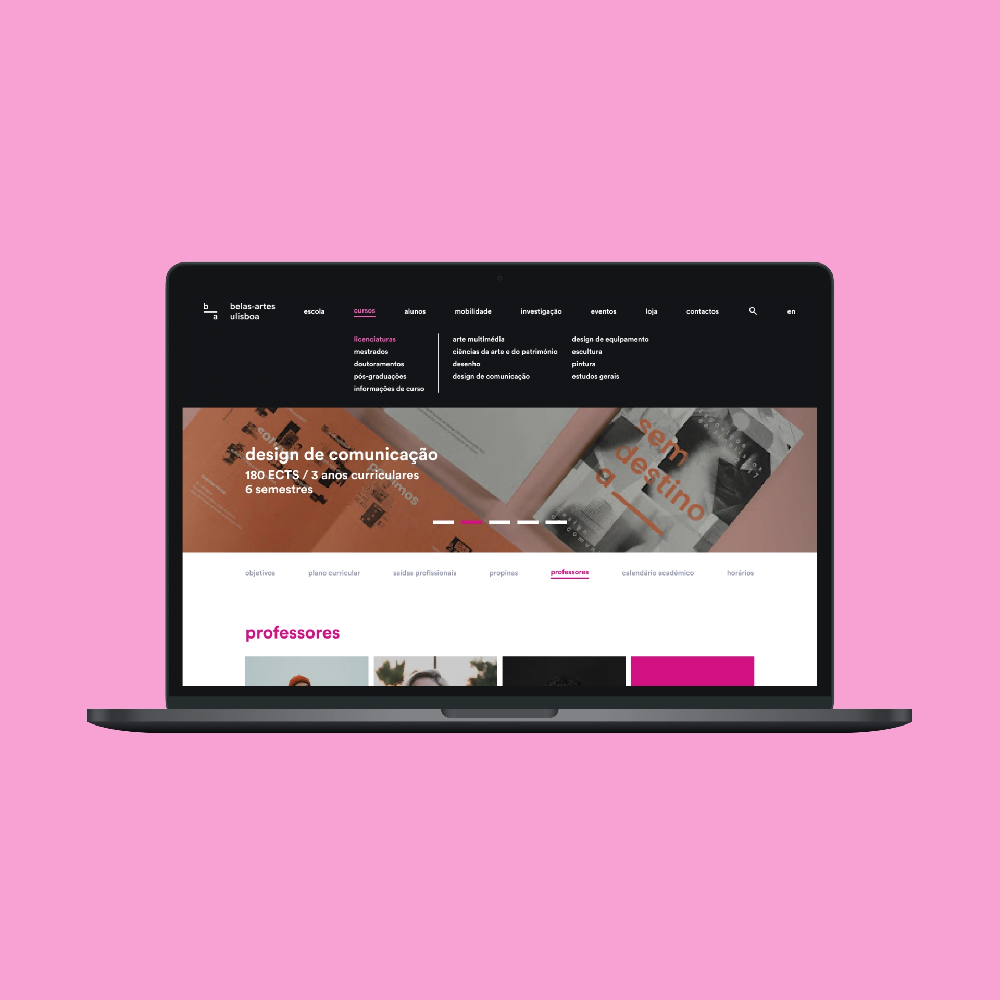

Tasked with overhauling the look and feel of our university's website, we started by doing extensive research and planning on what to change, for who to change it, and for what reasons.

From mapping out user segments to creating full sitemaps we planned and tested as thoroughly as we could to deliver the best experience possible for students both old and new.
